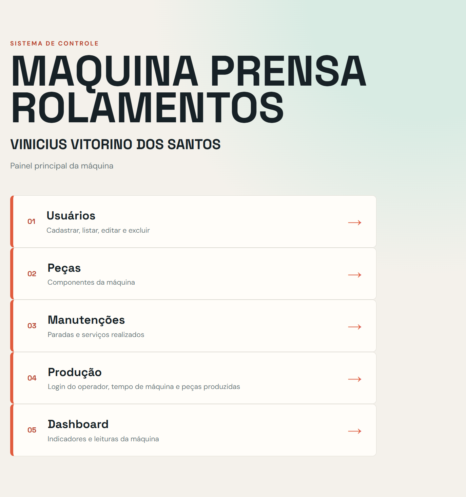
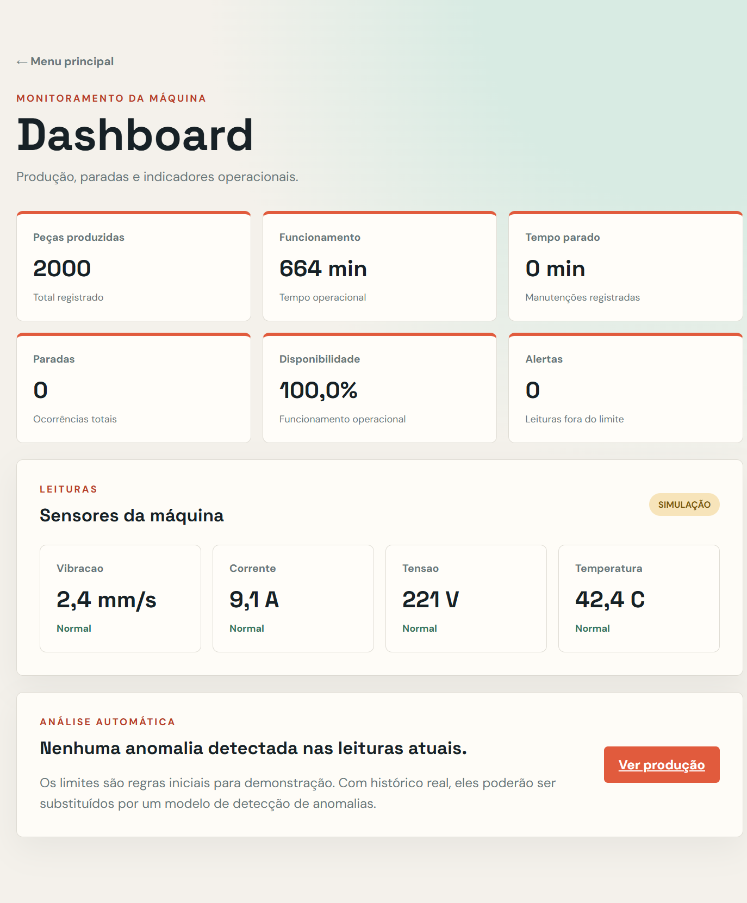

# Plataforma de Monitoramento Industrial

Sistema web para gerenciamento e monitoramento de maquinas industriais, desenvolvido a partir da Maquina Prensa Rolamentos como equipamento piloto.

O projeto reune cadastro de usuarios, controle de acesso, pecas, manutencoes, registros de producao e dashboards operacionais. A Prensa Rolamentos e o primeiro modelo de implementacao; a arquitetura foi pensada para receber outras maquinas, linhas e processos. Nesta primeira fase, as leituras de vibracao, corrente, tensao e temperatura sao simuladas para demonstracao.

## Intencao do sistema

O objetivo do projeto e criar uma plataforma aplicavel a diferentes maquinas industriais, aproximando o ambiente de producao de uma solucao SCADA: organizar usuarios e responsabilidades, registrar a operacao, acompanhar a producao, documentar manutencoes e transformar esses registros em informacoes para analise.

O MVP ainda nao comanda a maquina nem recebe sensores reais. Ele demonstra o fluxo de dados que, futuramente, podera sair de uma IHM ou CLP e alimentar um sistema de monitoramento industrial. A integracao inicial sera desenvolvida para a Prensa Rolamentos no TIA Portal, mas o mesmo modelo devera ser configuravel para outros equipamentos.

## Equipamento piloto e escalabilidade

A Prensa Rolamentos foi escolhida como equipamento piloto porque seu projeto de automacao esta em fase avancada no TIA Portal. A IHM e as telas do equipamento servirao como primeiro ambiente de validacao da plataforma.

O produto, entretanto, nao deve ser modelado como um sistema exclusivo dessa prensa. Cada maquina devera ser cadastrada com suas proprias caracteristicas:

- identificacao, modelo, linha e localizacao;
- sensores, unidades e limites operacionais;
- pecas e pontos de manutencao;
- estados e eventos do processo;
- producao, turnos e operadores;
- historico de falhas e intervencoes.

```text
Plataforma de monitoramento
|-- Maquina A: Prensa Rolamentos
|-- Maquina B: outra prensa
|-- Maquina C: esteira ou torno
`-- Maquina N: novo equipamento configurado
```

O nome Prensa Rolamentos identifica o piloto e a demonstracao atual. A plataforma deve permanecer neutra para que uma nova maquina seja adicionada por configuracao, sem reescrever o sistema.

## Visao da interface

### Menu operacional

O menu principal concentra os modulos da Maquina Prensa Rolamentos. Cada area representa uma etapa do processo: administracao de usuarios, componentes, manutencao, producao e analise.



### Dashboard de monitoramento

O dashboard apresenta os indicadores que apoiam a tomada de decisao: pecas produzidas, tempo de funcionamento, paradas, disponibilidade e leituras dos sensores. Os valores dos sensores aparecem como simulacao para deixar claro que esta e uma etapa de prototipo.



### Fluxo de informacao

```text
Operador registra producao
	+
Manutencao registra paradas
	+
Sensores simulados geram leituras
	|
	v
Banco H2 -> Dashboard -> Analise de indicadores
			 |
			 v
	  Futura integracao com IHM/CLP e Power BI
```

## Visao geral

```text
Menu principal da plataforma
|-- Usuarios: cadastro protegido pelo Admin
|-- Pecas: componentes da maquina
|-- Manutencoes: historico de servicos e paradas
|-- Producao: login do operador e log de producao
`-- Dashboard: indicadores e analise inicial por maquina
```

## Funcionalidades

- Cadastro, listagem, edicao e exclusao de usuarios.
- Tres niveis de acesso: Admin, Manutencao e Operador.
- Login administrativo para gerenciar usuarios.
- Login individual de operador para registrar producao.
- Validacao de CPF no formato `000.000.000-00`.
- Cadastro e listagem de pecas.
- Registro de manutencoes e tempo de parada.
- Log de producao com operador, inicio, fim e pecas produzidas.
- Calculo automatico do tempo de funcionamento.
- Dashboard com producao, funcionamento, paradas e disponibilidade.
- Leituras simuladas de vibracao, corrente, tensao e temperatura.
- Analise inicial por limites operacionais.

## Tecnologias

- Java 26.
- Spring Boot 4.1.1.
- Spring MVC e Thymeleaf.
- Spring Data JPA e Hibernate.
- H2 Database 2.4.240, persistido em arquivo.
- Maven.
- HTML e CSS responsivos.

Todas as tecnologias utilizadas sao gratuitas e possuem codigo aberto ou distribuicao gratuita.

## Requisitos para outra maquina

Instale apenas:

1. JDK 26.
2. Maven 3.9 ou superior.
3. VS Code, opcional, com o Extension Pack for Java.

Nao e necessario instalar MySQL, Docker ou um servidor web. O banco H2 roda dentro da aplicacao.

## Obtendo o projeto

Com Git instalado, clone o repositorio:

```powershell
git clone https://github.com/ViniciusVitorinoSantos/Maquina-Prensa-Rolamentos.git
cd Maquina-Prensa-Rolamentos
```

Se o repositorio tiver sido baixado como ZIP, extraia-o e abra a pasta que contem o arquivo `pom.xml`.

## Configurando o Java

Confirme que o Java 26 esta disponivel:

```powershell
java -version
```

O resultado deve indicar uma versao `26.0.x`.

Se houver mais de uma versao instalada, configure o terminal atual:

```powershell
$env:JAVA_HOME = 'C:\Program Files\Zulu\zulu-26'
$env:Path = "$env:JAVA_HOME\bin;$env:Path"
java -version
```

O caminho pode variar conforme a distribuicao do JDK instalada.

## Executando pelo VS Code

1. Abra a pasta do projeto no VS Code.
2. Abra `src/main/java/com/testejava/teste/TesteApplication.java`.
3. Clique em `Run` acima do metodo `main`.
4. Aguarde aparecer no terminal `Tomcat started on port 8080`.
5. Abra `http://localhost:8080`.

O processo precisa continuar aberto no terminal enquanto o sistema estiver sendo usado.

## Executando pelo Maven

Abra o PowerShell na pasta que contem o `pom.xml`:

```powershell
cd "caminho\\para\\Maquina-Prensa-Rolamentos"
$env:JAVA_HOME = 'C:\Program Files\Zulu\zulu-26'
$env:Path = "$env:JAVA_HOME\bin;$env:Path"
mvn spring-boot:run
```

Se a porta 8080 estiver ocupada, use outra porta:

```powershell
mvn spring-boot:run "-Dspring-boot.run.arguments=--server.port=8081"
```

Nesse caso, acesse `http://localhost:8081`.

## Acessando o sistema

Pagina inicial:

```text
http://localhost:8080/
```

Rotas principais:

| Area | Endereco |
| --- | --- |
| Menu | `/menu` |
| Usuarios | `/usuarios` |
| Pecas | `/pecas` |
| Manutencoes | `/manutencoes` |
| Producao | `/producao` |
| Dashboard | `/dashboard` |
| Console H2 | `/h2-console` |

## Primeiro acesso

### Administrador

O acesso administrativo inicial e definido em `src/main/resources/application.properties`:

```text
Login: admin
Senha: admin123
```

Entre em **Usuarios** com essas credenciais. Depois cadastre os operadores informando nome, CPF, login, senha e nivel `Operador`.

### Operador

Depois de cadastrado pelo Admin:

1. Acesse **Producao**.
2. Informe o login e a senha do operador.
3. Registre inicio, fim e quantidade de pecas produzidas.

Somente usuarios com nivel `Operador` podem entrar nessa area.

## Banco H2

O banco e criado automaticamente na primeira execucao e fica em:

```text
data/prensa-rolamentos.mv.db
```

Essa pasta esta no `.gitignore` porque contem dados locais. Ao clonar o projeto em outra maquina, o banco sera criado vazio, mas todas as tabelas serao recriadas automaticamente pelo JPA.

Para abrir o console H2, acesse `/h2-console` enquanto a aplicacao estiver rodando:

```text
JDBC URL: jdbc:h2:file:./data/prensa-rolamentos;AUTO_SERVER=TRUE
Usuario: sa
Senha: deixe vazia
```

Nao apague a pasta `data` se quiser preservar os registros locais.

## O que e demonstracao

O dashboard usa dados reais de producao e manutencao registrados no H2. As leituras de sensores sao simuladas e aparecem identificadas como `SIMULACAO`.

As regras atuais geram alertas quando:

- Vibracao ultrapassa `4.5 mm/s`.
- Corrente ultrapassa `12 A`.
- Tensao fica abaixo de `210 V` ou acima de `230 V`.
- Temperatura ultrapassa `70 C`.

Esses limites sao uma etapa inicial. Em ambiente industrial, devem ser definidos com base no equipamento, fabricante, processo e historico real.

## Estrutura principal

```text
src/main/java/com/testejava/teste/
|-- TesteApplication.java
|-- Usuario.java
|-- UsuarioController.java
|-- Peca.java
|-- PecaController.java
|-- DadoManutencao.java
|-- ManutencaoController.java
|-- RegistroProducao.java
|-- RegistroProducaoController.java
`-- DashboardController.java

src/main/resources/
|-- templates/       paginas Thymeleaf
|-- static/style.css estilos da interface
`-- application.properties configuracao do sistema
```

## Parando a aplicacao

No terminal onde o Spring Boot esta rodando, pressione:

```text
Ctrl + C
```

Os dados salvos no H2 permanecem no disco.

## Solucao de problemas

### `ERR_CONNECTION_REFUSED`

O servidor nao esta rodando ou a porta esta incorreta. Verifique o terminal e acesse a porta exibida pelo Tomcat.

### Java reconhece uma versao antiga

Feche o terminal, abra outro e configure `JAVA_HOME` para o JDK 26 antes de executar o Maven.

### Porta 8080 ocupada

Execute com outra porta, por exemplo `8081`, conforme mostrado acima.

### Banco H2 bloqueado

Feche outras instancias da aplicacao e o console H2. Execute apenas uma instancia por vez usando o mesmo arquivo de banco.

## Proximas etapas

- Criptografar senhas com BCrypt.
- Criar permissao detalhada por nivel.
- Substituir sensores simulados por MQTT, Modbus TCP ou OPC UA.
- Migrar H2 para PostgreSQL ou TimescaleDB em producao.
- Criar graficos historicos e exportacao para Power BI.
- Aplicar deteccao de anomalias com dados reais.

## Licenca

Este projeto e distribuido sob a licenca GPL-3.0. Consulte o arquivo `LICENSE` para os termos completos.
